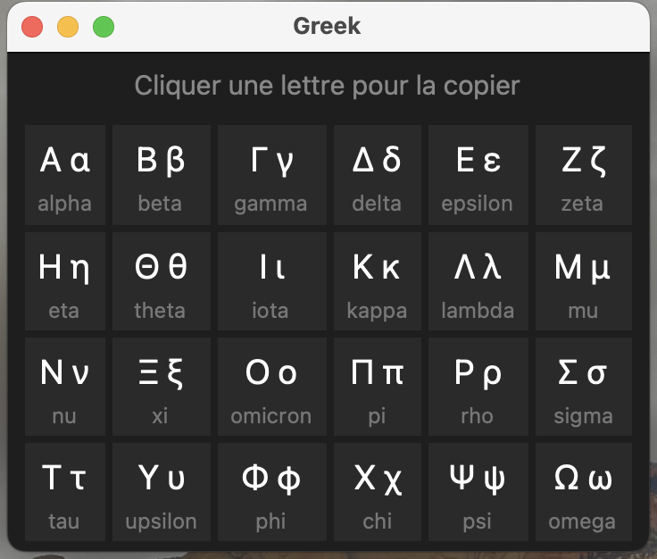

# Greek Picker

> Un petit sélecteur flottant de lettres grecques pour macOS. Raccourci clavier global, clic = copie dans le presse-papier.
>
> *A lightweight floating Greek letter picker for macOS. Global hotkey, one-click clipboard copy.*



🇫🇷 [Français](#français) · 🇬🇧 [English](#english)

---

## Français

Conçu pour les étudiants en sciences, ingénierie, maths ou physique qui en ont marre d'aller chercher α, β, π, Σ, Δ sur Wikipédia à chaque fois qu'ils écrivent un message ou prennent des notes.

### Fonctionnalités

- Fenêtre flottante toujours au-dessus, positionnée en haut à droite de l'écran
- 24 lettres grecques (Α–Ω) avec leur nom latin (alpha, beta, ...)
- **Clic gauche** → copie la minuscule (α, β, γ...)
- **Clic droit / ctrl-clic** → copie la majuscule (Α, Β, Γ...)
- Feedback visuel à la copie
- Échap pour fermer
- Déclenchable par un raccourci clavier global (⌃⌥G par défaut)

### Prérequis

- macOS (testé sur macOS 14+)
- Python 3 **installé depuis [python.org](https://www.python.org/downloads/macos/)** — le Python livré avec les outils Xcode embarque une version dépréciée de Tk qui ne rend pas correctement la fenêtre. C'est important.

### Installation

#### 1. Cloner le repo

```bash
git clone https://github.com/<ton-username>/greek-picker.git
cd greek-picker
```

#### 2. Placer le script

```bash
mkdir -p ~/GreekPicker
cp greek_picker.py ~/GreekPicker/
```

#### 3. Tester

```bash
/Library/Frameworks/Python.framework/Versions/Current/bin/python3 ~/GreekPicker/greek_picker.py
```

La fenêtre doit s'afficher avec la grille de lettres. Échap pour fermer.

#### 4. Créer une app via Automator

1. Ouvrir **Automator** → nouveau document → **Application**
2. Ajouter l'action **« Exécuter un script Shell »**
3. Coller :
   ```bash
   /Library/Frameworks/Python.framework/Versions/Current/bin/python3 $HOME/GreekPicker/greek_picker.py
   ```
4. **Décocher** « Exécuter en tant qu'administrateur »
5. Enregistrer dans `/Applications` sous le nom `GreekPicker`

#### 5. Assigner le raccourci ⌃⌥G

1. Ouvrir l'app **Raccourcis** (préinstallée sur macOS 12+)
2. Nouveau raccourci → ajouter l'action **« Ouvrir l'application »** → choisir `GreekPicker`
3. Cliquer sur l'icône ⓘ → **Ajouter un raccourci clavier** → taper ⌃⌥G

### Note sur le plein écran

macOS ne permet pas à une fenêtre externe de s'afficher par-dessus une app en **plein écran natif** (celui qui crée un Espace dédié). Pour que le picker s'affiche par-dessus une autre app, **maximiser** la fenêtre cible avec ⌥-clic sur le bouton vert au lieu d'utiliser le plein écran natif.

### Personnalisation

Le script est court et lisible. Modifications fréquentes :

- **Position de la fenêtre** : variables `x` et `y` dans `__init__`
- **Taille** : variables `win_w` et `win_h`
- **Couleurs** : codes hex `#1e1e1e`, `#2a2a2a`, etc.
- **Ajouter des symboles** (∇, ∂, ∞, ∫...) : étendre la liste `LETTERS`

### Limitations connues

- Ne fonctionne que sur macOS (utilise `pbcopy` pour le presse-papier)
- Nécessite Python depuis python.org (le Tk système est cassé)
- Ne colle pas directement dans le champ actif — le clic copie, ⌘V pour coller

### Licence

Aucune licence n'est attachée à ce projet. Le code est consultable mais pas réutilisable sans autorisation. Voir [choosealicense.com/no-permission](https://choosealicense.com/no-permission/) pour les détails.

---

## English

Built for science, engineering, math and physics students tired of fetching α, β, π, Σ, Δ from Wikipedia every time they write a message or take notes.

### Features

- Floating always-on-top window, positioned in the top-right corner of the screen
- 24 Greek letters (Α–Ω) with their Latin names (alpha, beta, ...)
- **Left-click** → copies the lowercase letter (α, β, γ...)
- **Right-click / ctrl-click** → copies the uppercase letter (Α, Β, Γ...)
- Visual feedback on copy
- Esc to close
- Triggered by a global keyboard shortcut (⌃⌥G by default)

### Requirements

- macOS (tested on macOS 14+)
- Python 3 **installed from [python.org](https://www.python.org/downloads/macos/)** — the Python that ships with Xcode tools includes a deprecated Tk version that fails to render the window properly. This matters.

### Installation

#### 1. Clone the repo

```bash
git clone https://github.com/<your-username>/greek-picker.git
cd greek-picker
```

#### 2. Place the script

```bash
mkdir -p ~/GreekPicker
cp greek_picker.py ~/GreekPicker/
```

#### 3. Test it

```bash
/Library/Frameworks/Python.framework/Versions/Current/bin/python3 ~/GreekPicker/greek_picker.py
```

The window should appear with the letter grid. Esc to close.

#### 4. Wrap it in an app via Automator

1. Open **Automator** → new document → **Application**
2. Add the **"Run Shell Script"** action
3. Paste:
   ```bash
   /Library/Frameworks/Python.framework/Versions/Current/bin/python3 $HOME/GreekPicker/greek_picker.py
   ```
4. **Uncheck** "Run as administrator"
5. Save it to `/Applications` as `GreekPicker`

#### 5. Bind the ⌃⌥G shortcut

1. Open the **Shortcuts** app (preinstalled on macOS 12+)
2. New shortcut → add the **"Open App"** action → pick `GreekPicker`
3. Click the ⓘ icon → **Add Keyboard Shortcut** → press ⌃⌥G

### Note about full-screen mode

macOS does not let an external window display on top of an app in **native full-screen mode** (the mode that creates a dedicated Space). To get the picker to overlay another app, **maximize** the target window with ⌥-click on the green button instead of using native full-screen.

### Customization

The script is short and readable. Common tweaks:

- **Window position**: `x` and `y` variables in `__init__`
- **Window size**: `win_w` and `win_h` variables
- **Colors**: hex codes `#1e1e1e`, `#2a2a2a`, etc.
- **Adding symbols** (∇, ∂, ∞, ∫...): extend the `LETTERS` list

### Known limitations

- macOS only (uses `pbcopy` for clipboard access)
- Requires Python from python.org (the system Tk is broken)
- Does not paste directly into the focused field — click copies, ⌘V pastes

### License

No license is attached to this project. The code is viewable but not reusable without permission. See [choosealicense.com/no-permission](https://choosealicense.com/no-permission/) for details.

---

*Built during BA2 microengineering at EPFL because copy-pasting from Wikipedia for every λ is a stupid friction cost.*
